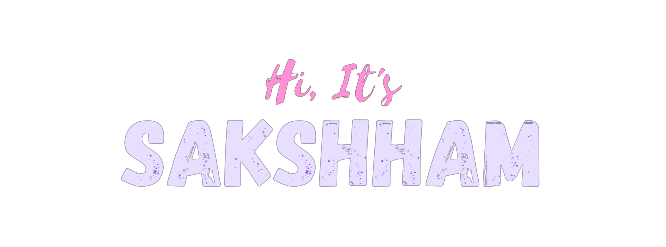

  

  <b>Full Stack Developer</b> building real-world web, mobile, and developer tooling systems used by startups, institutions, and open-source communities. I have worked on products used by <b>1500+ users</b>, institutional systems serving <b>50+ scholars & faculty</b>, and platforms processing <b>₹70K+ in real transactions</b>.

  
  

---

## About Me

- 🎓 Computer Engineering student at **Thapar Institute of Engineering & Technology**
- 🚀 Full Stack Developer building products across **web, mobile, backend, and cloud**
- 🛠️ Experienced with **React, Flutter, Go, Django, Node.js, PostgreSQL, Redis, Docker, Firebase, and GCP**
- 🚢 Experience shipping production systems, app-store releases, and cloud deployments
- 🎵 Producing **EDM music for 7+ years** using FL Studio

---

## Impact

- 👥 **1500+ users** across shipped products
- 🎓 **50+ scholars & faculty** using institutional systems
- 💸 **₹70K+** processed through deployed platforms
- ⭐ **75+ GitHub stars** on open-source tooling
- 📦 Distribution through **Homebrew, Scoop, and Winget**

---

## What I Like Building

- ⚡ Developer tools and automation systems
- 📱 Cross-platform apps and backend infrastructure
- 🏫 Internal platforms and institutional software
- 🐧 Linux tooling, self-hosting, and developer environments

---

## Some of my Work

<table>
<tr>

<td width="50%" valign="top">

### ADBT

Modern Android Debug Bridge TUI in **Go** with **75+ GitHub stars**, distributed through **Homebrew, Scoop, and Winget**.

**Stack**  
Go • CLI • TUI • GitHub Actions

</td>

<td width="50%" valign="top">

### Zyber

Built for an early-stage startup, deployed across **Android & iOS**, currently serving **1500+ users**.

**Stack**  
Flutter • Go • Redis • PostgreSQL • WebSockets

</td>

</tr>

<tr>

<td width="50%" valign="top">

### PhD Progress Monitoring Portal

Institutional platform serving **50+ scholars & faculty**, extended with research workflows and publication systems.

**Stack**  
Laravel • React • Flutter • MySQL • NGINX

</td>

<td width="50%" valign="top">

### CCS Merch Store

Production e-commerce platform handling **₹70K+ across 150+ orders** with payment and delivery systems.

**Stack**  
Django REST • React • PostgreSQL • Docker • GCP

</td>

</tr>
</table>

---

## Open Source

- Built **ADBT**, a modern Android Debug Bridge TUI written in **Go**
- Distributed tooling through **Homebrew**, **Scoop**, and **Winget**
- Building developer utilities, automation tools, and productivity-focused systems
- Open-source contributor across developer tooling and ecosystem projects

---

## Tech Stack

### Languages

  
  
  
  
  
  
  

### Frontend

  
  
  
  

### Backend & Databases

  
  
  
  
  
  
  
  

### Cloud & DevOps

  
  
  
  
  

---

## Community & Achievements

- 🏆 **Flipkart GRID 7.0 Semi-Finalist**
- 🏆 **ZS Campus Beats Tech Challenge** — Top 100 Teams Nationwide
- 👨‍💻 **PRISM Intern** at Samsung R&D Institute India
- 👨‍🏫 **Former Associate App Development Mentor** at GDSC TIET
- 💻 **Former Core Member** at Creative Computing Society (CCS), TIET
- 🎯 Co-organized **HackTU 6.0 MLH Hackathon** and **Syrinx CTF**

---

## GitHub Stats

        
      </td>
      <td align="center">
        

---

## Beyond Code

Outside software, I’ve been producing **EDM music for 7+ years** using FL Studio and enjoy sound design, audio engineering, and building immersive creative experiences.

Things I enjoy:

- 🎵 Music production & sound design
- 🐧 Linux customization and Hyprland setups
- ⚡ Building tools that solve annoying real-world problems

---

## Connect With Me

  

  

  

